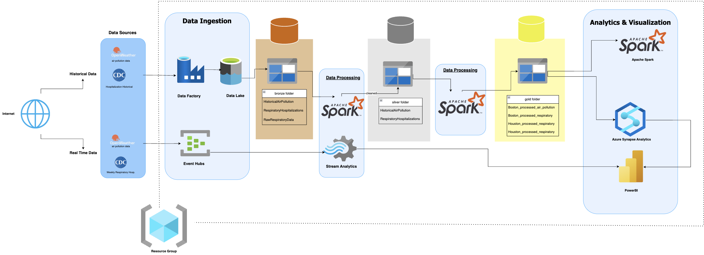

# Azure Weather & Air Pollution Analytics Project

## Overview
This project uses Azure cloud services to collect, process, and analyze weather and air pollution data from OpenWeather API. The system provides both historical analysis and real-time monitoring capabilities through a series of interconnected Azure services and Power BI visualizations.

## Architecture

## Components

### Data Collection
- **Azure Function App (Harshfunctionapp)**: Triggers data collection from OpenWeather API at regular intervals
- **Event Hubs Namespace (harsh598namespace)**: Manages real-time event streaming

### Data Storage & Processing
- **Storage Account (harshshahstorage)**: Stores raw and processed data
- **Data Factory (Harsh-Shah-DataFactory)**: Orchestrates the data processing workflow
- **Synapse Analytics (harsh-synapse)**: Processes and analyzes the collected data
- **Stream Analytics (Harsh_stream_analytics_ds598)**: Processes real-time data streams
- **Apache Spark Pool (openweather)**: Performs complex data processing using Spark

### Web Hosting
- **App Service Plan (ASP-HarshShahds598-bff6)**: Hosts the web application

### Visualization
- **Power BI**: Creates interactive dashboards and reports

## Data Flow
1. Weather and air pollution data is collected from OpenWeather API using Azure Functions
2. Raw data is stored in Azure Storage
3. Data Factory orchestrates the processing pipeline
4. Synapse Analytics processes and analyzes the data
5. Stream Analytics handles real-time data processing
6. Processed data is visualized in Power BI dashboards

## Key Features
- **Real-time Monitoring**: Track current weather conditions and air quality metrics
- **Historical Analysis**: Analyze trends and patterns over time
- **Correlation Analysis**: Identify relationships between weather conditions and air quality
- **Customizable Dashboards**: Tailor visualizations to specific needs
- **Alerting**: Set up notifications for significant events or threshold breaches

## Documentation
- [Setup Guide](docs/setup-guide.md): Detailed instructions for deploying and configuring the solution
- [Data Dictionary](docs/data-dictionary.md): Descriptions of data fields and structures
- [Usage Examples](docs/usage-examples.md): Common use cases and scenarios
- [Architecture Overview](docs/architecture.md): Detailed technical architecture

## Power BI Visualizations
The project includes several Power BI dashboards:
- Air Quality Trend Analysis
- Weather Pattern Visualization
- Real-time Monitoring Dashboard
- Correlation Analysis

## Deployment
The entire solution can be deployed using the ARM templates provided in the `infrastructure` directory. See the [Setup Guide](docs/setup-guide.md) for detailed instructions.

## Prerequisites
- Azure subscription (Azure for Students or other subscription)
- OpenWeather API access (sign up at https://openweathermap.org/api)
- Power BI Desktop (for local visualization)

## Contributing
Contributions are welcome! Please feel free to submit a Pull Request.
