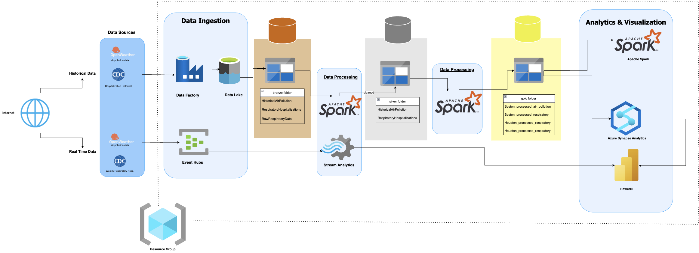

# Respiratory Hospitalization Forecasting from Air Pollution Trends

A predictive analytics pipeline that estimates future **influenza-related hospitalizations** using historical and real-time **air pollution** and **respiratory hospitalization** data, leveraging modern machine learning and time series forecasting techniques.

## 🔎 Overview

- **Objective:**  
  Predict respiratory-related hospitalizations based on environmental pollution indicators and healthcare trends.
  
- **Scope:**  
  Model trained and validated for **Boston (MA)** and **Houston (TX)** with future forecasts aligned to real-world hospitalization reports.

- **Tech Stack:**  
  Azure Data Factory, Azure Synapse Analytics, Azure ML, Pandas, PySpark, XGBoost, SARIMAX, Power BI.

## Architecture

## 📂 Datasets

### Historical Data

| Dataset | Source |
|---------|--------|
| US Hospitalization Data | Kaggle Healthcare Dataset |
| Air Pollution Data | OpenWeather Historical (API) |
| US Respiratory Hospitalization Data | CDC / Data.gov |

### Real-Time Data

| Dataset | Source |
|---------|--------|
| Weekly Respiratory Hospitalizations | CDC |
| Real-Time Air Pollution | OpenWeather, OpenAQ, EPA |

## 🔧 Methodology

### 1️⃣ **Data Ingestion**
- Batch ingestion via **Azure Data Factory** (ADF).
- Real-time ingestion with **Azure Event Hubs**.
- Storage: **Azure Data Lake Storage (ADLS)**.

### 2️⃣ **Data Processing**
- Cleaning & transformation with **Azure Synapse** / **PySpark**.
- Missing value imputation.
- Lagged feature creation for time-dependent correlations.
- Seasonality, holidays, and school session features engineered.

### 3️⃣ **Model Development**
- Feature engineering in **Azure Synapse / Pandas**.
- Model training with **XGBoost Regressor**.
- TimeSeries cross-validation for robustness.
- Log transformation for stability.
- SARIMAX also evaluated for comparison.

### 4️⃣ **Forecasting**
- 6-week forward forecasts for Boston & Houston.
- Forecast influenza-related ED visits and transform into expected state-level hospitalizations using scaling and hospitalization rate.

### 5️⃣ **Visualization & Alerts**
- Visualization: **Power BI**.

- Real-time alerts planned via **Azure Logic Apps**.

- EDA and performance evaluation in **Jupyter Notebook**.

### 6️⃣ **Cost & Scalability**
- Resource optimization with **Azure Cost Management**.
- Auto-scaling compute resources.

## 📊 Model Performance Summary

| City | Train R² | Test R² | Accuracy | MAPE (%) |
|------|----------|---------|----------|----------|
| Boston | 0.997 | 0.177 | 54.8% | 37.1% |
| Houston | 0.997 | 0.177 | 54.8% | 220.4% |

**Note:** Houston MAPE is higher due to extreme variability and large swings in visit counts.

## 🔮 6-Week Forecasts (Visits → State Hospitalizations)

| City | Date | Predicted Visits | Predicted State Hospitalizations |
|------|------|------------------|---------------------------------|
| Boston | 2025-04-05 | 1,045,808 | 125 |
| ... | ... | ... | ... |
| Houston | 2025-04-05 | 5,627,042 | 844 |
| ... | ... | ... | ... |

**Uncertainty bounds:** ±30% around predicted state hospitalizations.

## 📈 Actual vs Predicted Comparison

### Boston

| Date | Predicted | Actual |
|------|-----------|--------|
| 2025-04-05 | 125 | 130 |
| 2025-04-12 | 126 | 91 |
| 2025-04-19 | 126 | 83 |
| 2025-04-26 | 125 | 81 |

### Houston

| Date | Predicted | Actual |
|------|-----------|--------|
| 2025-04-05 | 844 | 351 |
| 2025-04-12 | 838 | 267 |
| 2025-04-19 | 839 | 250 |
| 2025-04-26 | 877 | 224 |

**Boston MAPE:** 37.1%  
**Houston MAPE:** 220.4%

## 📁 Final Data Files

| File | Description |
|------|-------------|
| Boston_Houston_Pred_vs_Actual_Final.parquet | EDA comparison data |
| Boston_Houston_6Week_Forecasts.parquet | Forecast data |
| Boston_Houston_Model_Performance_AllWeeks.parquet | Model predictions vs actuals (full history) |

## 🚀 Future Enhancements

- Extend models to cover age groups/demographics.
- Tune hospitalization rate conversions based on newer research.

## 👏 Contributors

Harsh Shah, Cordell Cheng, Viktoria Zruttova

---

_Last updated: 05-04-2025_
